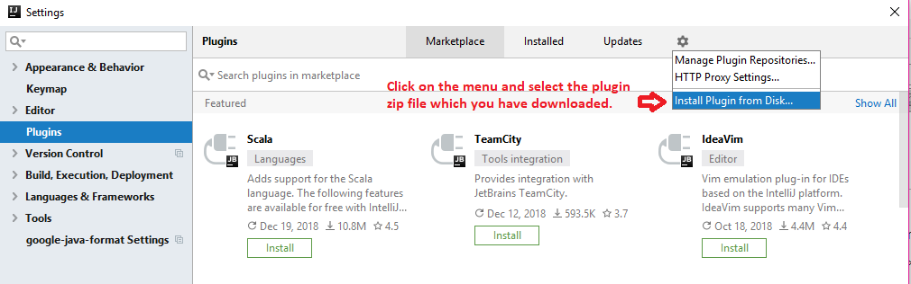
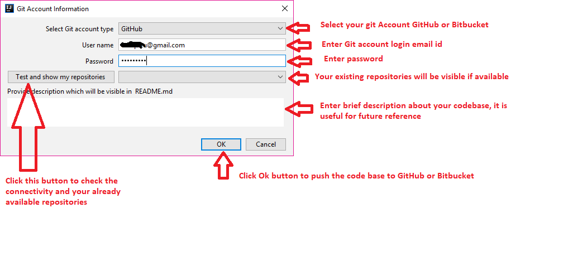
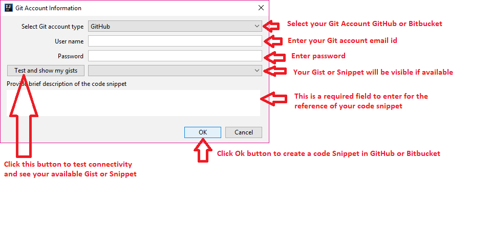

 

IntelliJ IDEA Plugin for Code Push in GitHub and Bitbucket
==========================================================================================

Introduction
============
**Git Pusher** is an IDEA plugin which helps in pushing the complete codebase or code snippet directly to GitHub or Bitbucket. This plugin does not provide any git functionality, it only provides a easy way to keep the code in GitHub or Bitbucket for future references. Many times, developers write good code and code goes into lost world after some time. This plugin will help you to save and share your code in GitHub and Bitbucket.

Advantages of Gitpusher
================

* **A hassle free way to push code base in GitHub or Bitbucket.**
* **Easy to create a code snippet and share with your friends.**
* **A non blocking way to push the code or code snippet.**
* **Easy to work as it has been developed using pure java and it is free and open source.**

Technology Stack
================
The following framework/s and tool/s have been used in this current sample application.

<table border="1">
  <tr>
    <th>Name</th>
    <th>Version</th> 
  </tr>
  <tr>
    <td>Java</td>
    <td>1.8</td> 
  </tr>
  <tr>
    <td>IntelliJ Platform (Open API & Swing)</td>
    <td>2018</td>
  </tr>
  <tr>
    <td>Gradle</td>
    <td>4.6</td>
  </tr>
  <tr>
    <td>Eclipse eGit framework</td>
    <td>5.2</td> 
  </tr>
</table>

How to use it ?
===============
Please Download  from the latest download directory.

Download the zip file and install as in File -> Settings -> Plugins.

See the screen shot below.

See the screenshots give below to know its usage.

* **To create a project in GitHub/Bitbucket**

* **To create a Gist in GitHub or Snippet in Bitbucket**

Bugs and Feedback
=================
There may be some bugs or error, please feel free to report to me at deba.java@gmail.com

Contributor
==========
@Author : **Debadatta Mishra (PIKU)** [Know me](https://about.me/debadattamishra)

Conclusion
==========
Hope you have enjoyed my small utility plugin, try to learn and explore more and share with all.

